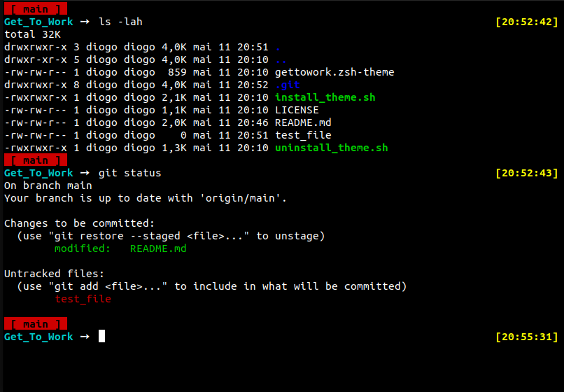

# Get To Work

This is a custom Zsh theme designed to enhance your command-line interface experience.

## Features

- Displays a Git prompt indicating the current branch and status.
- Shows a virtual environment indicator if one is activated.
- Time-stamped right-prompt.
- Clean and minimalistic design.

## Preview



## Installation

To install this theme, you can simply run the following command:

```bash
curl -fsSL https://raw.githubusercontent.com/Diogo13Antunes/Get_To_Work/main/install_theme.sh | bash
```

This will automatically install the theme and configure your Zsh.

## Installation

To update this theme, you can simply run the following command:

```bash
curl -fsSL https://raw.githubusercontent.com/Diogo13Antunes/Get_To_Work/main/update_theme.sh | bash
```

This will automatically update the theme and configure your Zsh.

## Unistall

If you want to revert to your previous Zsh settings, you can uninstall this theme by running:

```bash
curl -fsSL https://raw.githubusercontent.com/Diogo13Antunes/Get_To_Work/main/uninstall_theme.sh | bash
```

This will remove the theme and restore your original Zsh configuration.

## Theme Customization

This theme is designed with customization in mind. You can adjust it according to your preferences. Below are the key features you can modify:

- **Git Prompt Configuration**	: You can change the appearance of the Git prompt by modifying the following variables in your '~/.zshrc':

```bash
ZSH_THEME_GIT_PROMPT_PREFIX="[ "
ZSH_THEME_GIT_PROMPT_SUFFIX=" ]"
ZSH_THEME_GIT_PROMPT_DIRTY=""
ZSH_THEME_GIT_PROMPT_CLEAN=""
```

- **Right Prompt (RPROMPT)**: The right-prompt shows the current time. You can adjust its appearance in '~/.zshrc':

```bash
RPROMPT='%B%{$FG[011]%}[%D{%H:%M:%S}]%{$reset_color%}%b'
```

- **Custom Prompt (PROMPT)**: The main prompt is customized using the 'set_prompt' function in your '~/.zshrc'. This function sets the '**PROMPT**' variable according to Git status and virtual environment:

```bash
function set_prompt() {
  # Customize PROMPT here
}
```

## Author

This theme was created by [Diogo13Antunes](https://github.com/Diogo13Antunes).

## License

This project is licensed under the MIT License - see the [LICENSE](LICENSE) file for details.
